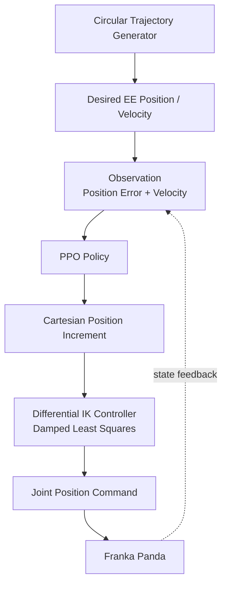

# PPO-DLS Franka Trajectory Tracking

A hybrid reinforcement learning controller combining PPO residual policy and Damped Least Squares (DLS) inverse kinematics for Franka Panda end-effector trajectory tracking.

## Control Architecture




## Method

The PPO policy outputs a Cartesian position increment. The Differential IK controller converts task-space commands into joint-space targets using DLS inverse kinematics.

## Environment

- Isaac Lab
- Isaac Sim
- Franka Panda
- RSL-RL PPO
- Differential IK with DLS

## Files

```text
trajectory_command.py
```

- Generate continuous circular end-effector trajectory

```text
franka_trajectory_env_cfg.py
```

- Define PPO environment
- Configure Cartesian action space
- Configure DLS inverse kinematics

## Results

Training:

- PPO
- 200 iterations
- 76800 steps

Tracking performance:

- RMSE: add your value
- MAE: add your value
